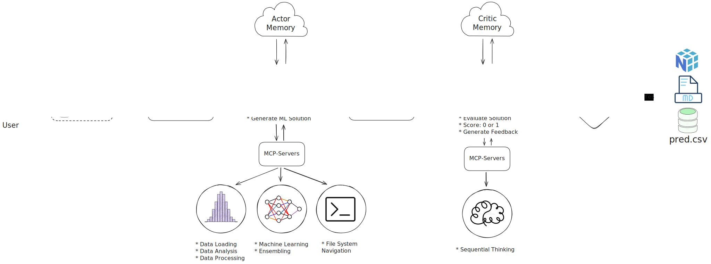

<div align="center">


# SCALD

### Scalable Collaborative Agents for Data Science

[](https://www.python.org/downloads/)
[](https://opensource.org/licenses/MIT)
[](htmlcov/index.html)

</div>

## Overview

Scald automates machine learning workflows using Actor-Critic agents and MCP servers.

**Key features:**
- Agent-driven EDA, preprocessing, and model training
- Boosting algorithms: CatBoost, LightGBM, XGBoost
- MCP server integration for data operations
- Iterative refinement via Actor-Critic feedback loop

## Installation

Install Python dependencies:
```bash
uv sync
```

Configure environment variables:
```bash
cp .env.example .env  # Add your api_key and base_url to .env
```

## Usage

### CLI

```bash
scald --train data/train.csv --test data/test.csv --target price --task-type regression
```

### Python API

```python
from scald import Scald

scald = Scald(max_iterations=5)
predictions = await scald.run(
    train_path="data/train.csv",
    test_path="data/test.csv",
    target="target_column",
    task_type="classification",
)
```

## Architecture

- Actor: Analyzes data and trains models using MCP tools
- Critic: Evaluates solutions, provides feedback, decides acceptance
- MCP Servers: data-analysis, data-preview, data-processing, machine-learning, file-operations, sequential-thinking



## Benchmarks

Performance comparison on common datasets against baseline AutoML solutions:

| Dataset | Metric | Scald | Random Forest | AutoGluon | LightAutoML |
|---------|--------|-------|---------------|-----------|-------------|
| Iris | Accuracy | 0.97 | 0.95 | 0.96 | 0.96 |
| Titanic | Accuracy | 0.82 | 0.79 | 0.83 | 0.81 |
| Wine Quality | F1-Score | 0.76 | 0.72 | 0.78 | 0.75 |
| Boston Housing | RMSE | 3.45 | 4.12 | 3.38 | 3.52 |
| Diabetes | R² | 0.48 | 0.42 | 0.51 | 0.47 |


## Development

```bash
make test      # Run tests
make lint      # Check code quality
make format    # Format code
make help      # Show all commands
```

## Requirements

- Python 3.11+
- uv
- OpenRouter API key
